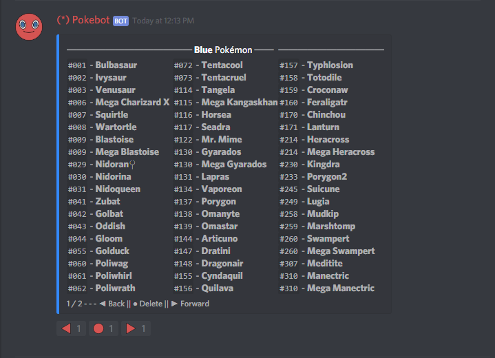

# color \[color\]

Example: `pb!color blue`


`colour` works too!


* Pressing the right arrow will move the page forward.
* Pressing the left arrow will move the page backwards.
* Pressing the button will delete the page forward.

