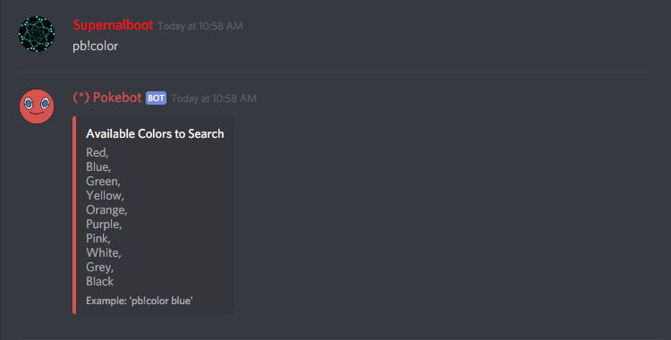

# Color \(color/colour\) Command

## pb!color

Shows a list of colors Users can use to search Pokemon by.

## pb!color \(color\)

Pokemon can also be filtered and searched by color. Say a User remembers a Pokemon's color, Green for example but they cant remember its name, Ndex, or Category, they can use `pb!color green`.


`colour` works too!



Sometimes a color list will be too large to fit into one page so Pokebot will add pages to switch through.


