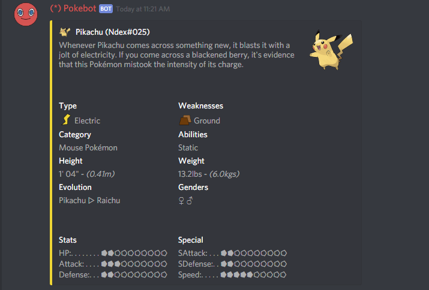

# Pokedex \(pd\) Command

#### Pokebot's info-cards are the equivalent to a Pokedex entry and contain an abundance of information about that Pokemon, this is Pikachu's below...

## pb!pd

This will return a list of all the Pokemon we currently have an info-card for, you can go through the pages with the **left** and **right** reactions, and close it with the **circle** reaction.

## pb!pd \(ndex\)

Search through our database using the Pokemon's National Pokedex Number, for example, Pikachu's is `#151` so to get Pikachu's info-card you can do `pb!pd 151` it's that simple! A list of Pokemon by [Ndex](https://bulbapedia.bulbagarden.net/wiki/List_of_Pok%C3%A9mon_by_National_Pok%C3%A9dex_number).


Some Pokemon have forms so using their NDex number wont work if you're looking for a Pokemon form! Please use the [Naming](./#pb-pd-name) feature below.


## pb!pd \(name\)

Search through the database just by searching it's name! If you can only remember part of it, we'll list some options for you. `pb!pd Bulbasaur` will bring up Bulbasaur's info-card, where-as `pb!pd saur` brings up any Pokemon with `saur` in their name.

The [`alola`](pd-alola.md) and [`mega`](pd-mega.md) commands work similar to this, but only searching through the Alolan Pokedex and Mega Evolutions.

