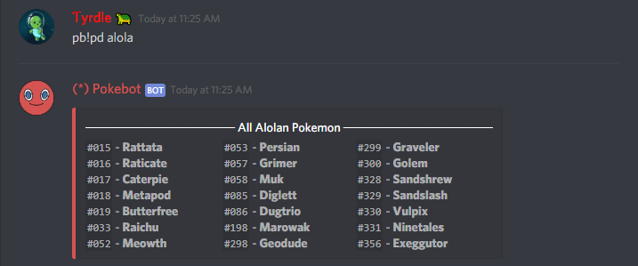
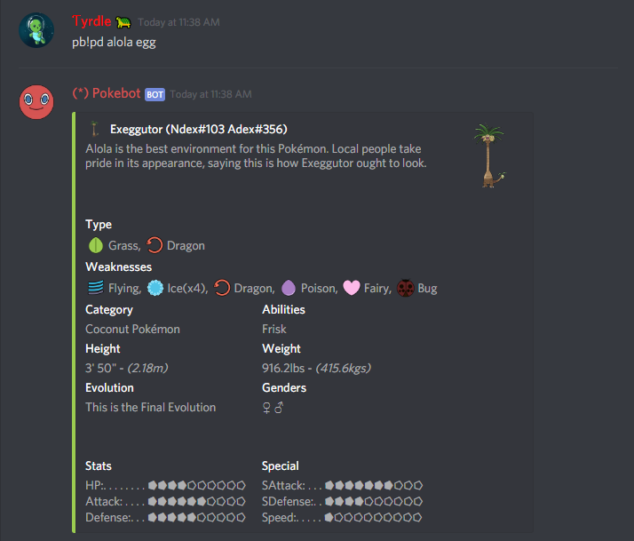

# Pokedex Alola \(pd alola\) Command

## pb!pd alola

List all the Alolan Pokemon in our database.

## pb!pd alola \(adex\)

Search through our database using the Pokemon's National Pokedex Number, for example, Alolan Raichu's is `#33` so to get Alolan Raichu's info-card you can do `pb!pd alola 33` A list of Pokemon by [Adex](https://bulbapedia.bulbagarden.net/wiki/List_of_Pok%C3%A9mon_by_Alola_Pok%C3%A9dex_number_%28Ultra_Sun_and_Ultra_Moon%29).

## pb!pd alola \(name\)

Search through the Alolan database just by searching it's name! If you can only remember part of it, we'll list some options for you. `pb!pd alolan raichu` brings up Alolan Raichu's info-card and `pb!pd alola egg` returns Exeggutor since that Pokemon will be the only Alolan Pokemon returned in the list.

