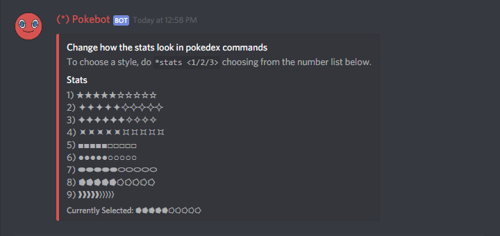

# Stats \(stat\) Command

## pb!stats

Dont like how the stats appear for your Pokemon? Well the User can simply change how they look by doing `pb!stats` which shows a list of available symbols.

## pb!stats \(number\)

The User can then select what symbol they want by doing `pb!stats 6`.

