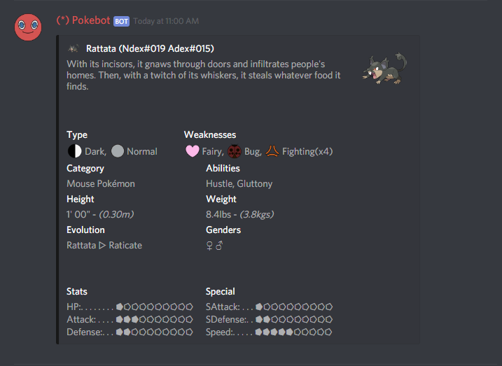

# Pokedex

## pd

The Pokedex command `pd` shows every Pokemon available to search for.

Users will be able to switch pages using the left and right arrows and cancel by pressing the center button.

## pd \[dexNum\]

Users can search Pokemon using their National Dex number displaying information about that Pokemon.

## pd \[name\]

Users can also search Pokemon via name.

## pd alola

Using this command allows users to see a list of alolan type Pokemon.

## pd alola \[dexNum\]

Users can search Pokemon using their Alola Dex number displaying information about that Pokemon.

## pd alola \[name\]

Users can also search Pokemon via name.

