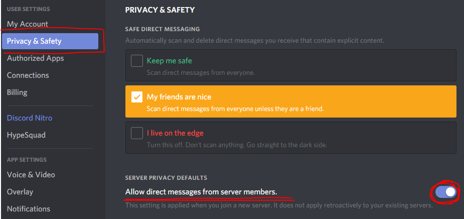

# FAQ

## What is Pokebot?

Pokebot is a Discord bot created to help people obtain information about a Pokemon further developing their skills on learning type weaknesses, strengths, stats, and abilities.

## I have a problem with Pokebot where do I go?

You can join our Official Support Server [here](https://discordapp.com/invite/qu2mvH2) to get support.

## I'm not getting DMs from Pokebot?

Pokebot cannot send DMs if they are set to closed, if you are also not getting DMs about Pokecord spawns please make sure your presence in discord is not Offline or DND if problems persist feel free to join the support server for assistance.

Make sure the setting below is turned on!

